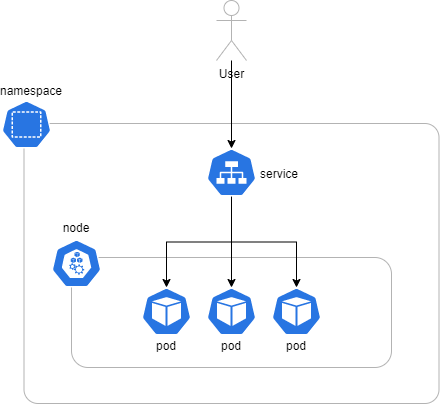

# Introduction

In this challenge you will provision web application hosted by Kubernetes using... **one command**.

What you need to know:

- `pod`: this is a place where container with your app is kept
- `node`: this is a computer (or virtual machine) with Kubernetes installed
- `service`: provides connectivity to pods (multiple instances of your app)
